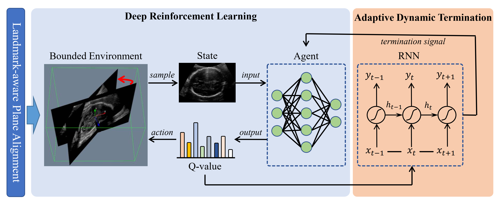
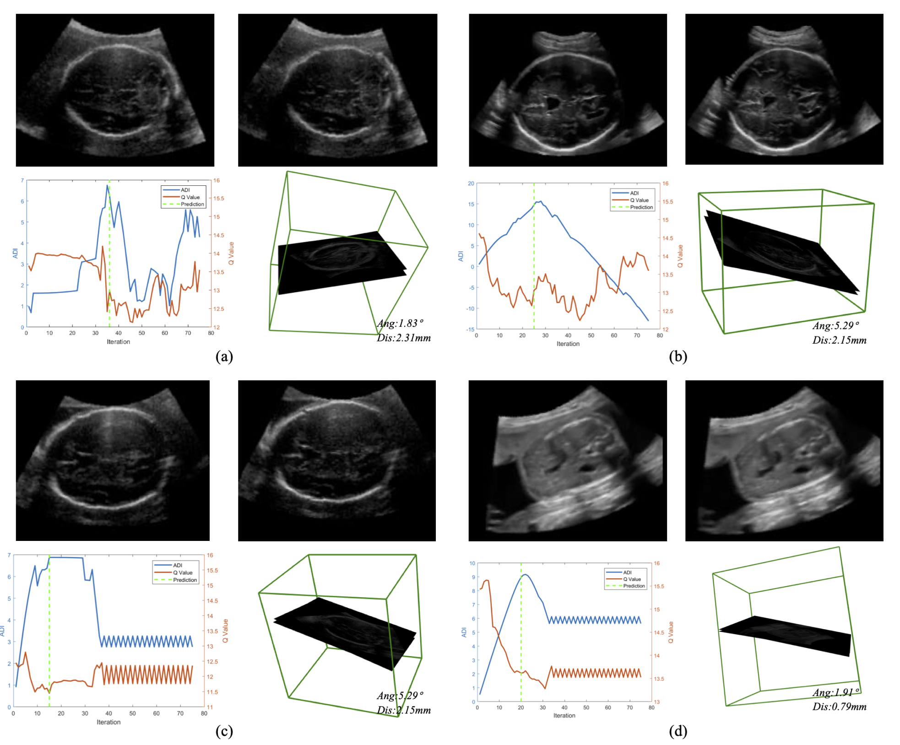

<!--
 * @Author: Shuangchi He / Yulv
 * @Email: yulvchi@qq.com
 * @Date: 2022-03-20 23:40:56
 * @Motto: Entities should not be multiplied unnecessarily.
 * @LastEditors: Shuangchi He
 * @LastEditTime: 2022-03-27 21:42:59
 * @FilePath: /Awesome-Ultrasound-Standard-Plane-Detection/code/AgentSPL/README.md
 * @Description: Modify here please
 * Init from https://github.com/wulalago/AgentPL main b04524628764dd3b748b0f191462fd82d29804cc
-->

# Reinforcement Learning for Standard Plane Localization in 3D US

This repository is the implementation of the deep reinforced framework for standard plane localization by Haoran Dou in MUSIC Lab at Shenzhen University.

**Agent with Warm Start and Active Termination for Plane Localization in 3D Ultrasound**  
*Haoran Dou, Xin Yang, Jikuan Qian, Wufeng Xue, Hao Qin, Xu Wang, Lequan Yu, Shujun Wang, Yi Xiong, Pheng-Ann Heng, and Dong Ni.*  
International Conference on Medical Image Computing and Computer Assisted Intervention, 2019. [[Paper]](https://link.springer.com/chapter/10.1007/978-3-030-32254-0_33) [[arXiv]](https://arxiv.org/abs/1910.04331)

**Agent with Warm Start and Adaptive Dynamic Termination for Plane Localization in 3D Ultrasound**
*Xin Yang, Haoran Dou, Ruobing Huang, Wufeng Xue, Yuhao Huang, Jikuan Qian, Yuanji Zhang, Huanjia Luo, Huizhi Guo, Tianfu Wang, Yi Xiong, and Dong Ni.*  
IEEE Transactions on Medical Imaging. [[Paper]](https://ieeexplore.ieee.org/document/9389756) [[arXiv]](https://arxiv.org/abs/2103.14502)

  

> Accurate standard plane (SP) localization is the fundamental step for prenatal ultrasound (US) diagnosis. Typically, dozens of US SPs are collected to determine the clinical diagnosis. 2D US has to perform scanning for each SP, which is time-consuming and operator-dependent. While 3D US containing multiple SPs in one shot has the inherent advantages of less user-dependency and more efficiency. Automatically locating SP in 3D US is very challenging due to the huge search space and large fetal posture variations. Our previous study proposed a deep reinforcement learning (RL) framework with an alignment module and active termination to localize SPs in 3D US automatically. However, termination of agent search in RL is important and affects the practical deployment. In this study, we enhance our previous RL framework with a newly designed adaptive dynamic termination to enable an early stop for the agent searching, saving at most 67% inference time, thus boosting the accuracy and efficiency of the RL framework at the same time. Besides, we validate the effectiveness and generalizability of our algorithm extensively on our in-house multi-organ datasets containing 433 fetal brain volumes, 519 fetal abdomen volumes, and 683 uterus volumes. Our approach achieves localization error of 2.52mm/10.26°, 2.48mm/10.39°, 2.02mm/10.48°, 2.00mm/14.57°, 2.61mm/9.71°, 3.09mm/9.58°, 1.49mm/7.54° for the transcerebellar, transventricular, transthalamic planes in fetal brain, abdominal plane in fetal abdomen, and mid-sagittal, transverse and coronal planes in uterus, respectively. Experimental results show that our method is general and has the potential to improve the efficiency and standardization of US scanning.

## Usage

### Dataset Setting

The data folder should be placed as following:

```txt
-- data  
   --- subjects  
       ---subject 1  
          ---data.nii.gz   # the ultrasound volume  
          ---info.npz  # contain the information (plane parameters)  
       ---subject 2  
          ...  
       --- atlas  # the atlas used for training  
          ---data.nii.gz   
          ---info.npz  
  --- list_train.txt # subject name list  
  --- list_val.txt  
  --- list_test.txt  
```

Folder 'example_data' stores an example volume (fake_data.nii.gz), plane parameter file (info.npz) and visual cross-section (data_three.png).

### Training

``` bash
cd code/AgentSPL
python train.py
```

### Generate the training samples for RNN(termination)

``` bash
cd code/AgentSPL
python create_training_sample.py
```

## Results



## Citation  

If this work is helpful for you, please cite our paper as follows:

```txt
@inproceedings{dou2019agent,
  title={Agent with Warm Start and Active Termination for Plane Localization in 3D Ultrasound},
  author={Dou, Haoran and Yang, Xin and Qian, Jikuan and Xue, Wufeng and Qin, Hao and Wang, Xu and Yu, Lequan and Wang, Shujun and Xiong, Yi and Heng, Pheng-Ann and others},
  booktitle={International Conference on Medical Image Computing and Computer-Assisted Intervention},
  pages={290--298},
  year={2019},
  organization={Springer}
}
```

```txt
@ARTICLE{9389756,
  author={Yang, Xin and Dou, Haoran and Huang, Ruobing and Xue, Wufeng and Huang, Yuhao and Qian, Jikuan and Zhang, Yuanji and Luo, Huanjia and Guo, Huizhi and Wang, Tianfu and Xiong, Yi and Ni, Dong},
  journal={IEEE Transactions on Medical Imaging}, 
  title={Agent With Warm Start and Adaptive Dynamic Termination for Plane Localization in 3D Ultrasound}, 
  year={2021},
  volume={40},
  number={7},
  pages={1950-1961},
  doi={10.1109/TMI.2021.3069663}}
```
