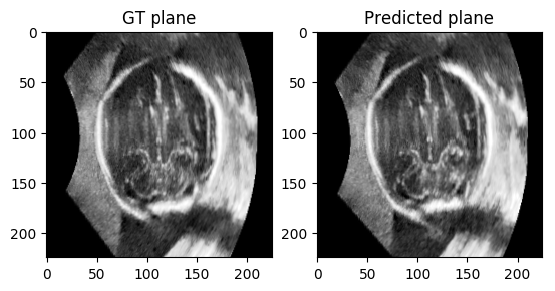
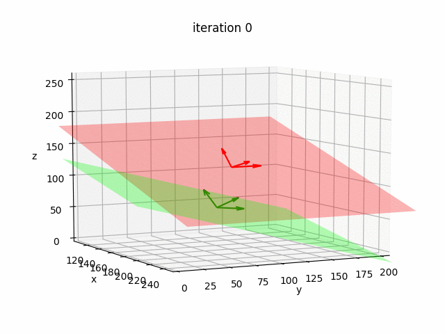
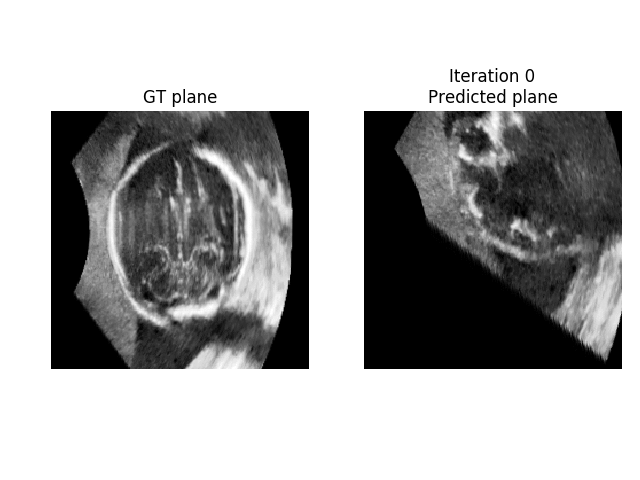

<!--
 * @Author: Shuangchi He / Yulv
 * @Email: yulvchi@qq.com
 * @Date: 2022-03-18 23:10:52
 * @Motto: Entities should not be multiplied unnecessarily.
 * @LastEditors: Shuangchi He
 * @LastEditTime: 2022-03-23 14:32:35
 * @FilePath: /Awesome-Ultrasound-Standard-Plane-Detection/src/ITN/README.md
 * @Description: Modify here please
 * Init from https://github.com/yuanwei1989/plane-detection
-->

# Standard Plane Localisation in 3D Ultrasound

This software implements a Convolutional Neural Network (CNN) for the automatic localisation of standard scan planes in 3D ultrasound of the fetal head.

Tensorflow implementation of the MICCAI 2018 paper [Standard Plane Detection in 3D Fetal Ultrasound Using an Iterative Transformation Network](https://arxiv.org/abs/1806.07486).


## Prerequisites

- python 3.7
- tensorflow-gpu 1.14
- scipy
- (Optional) nibabel (for reading NIfTI input)
- (Optional) matplotlib (for visualization)
- (Optional) scikit-image 0.15 (for computing SSIM)
- (Optional) [srmg](https://github.com/bishesh/statsCompare-RiemannianManifold-Groups) (for computing Riemannian mean. Already included in this repo)
- (Optional) [transformations.py](https://www.lfd.uci.edu/~gohlke/code/transformations.py.html) (for computations on rotation matrices, Euler angles and quaternions. Already included in this repo)

## Usage

To train a CNN model:

``` bash
cd src/ITN
python train.py
```

To test with an existing CNN model:

``` bash
cd src/ITN
python infer.py
```

## Data

We are not able to share the dataset we used for the paper due to sensitive patient information. However, we have provided a dummy data which is a random noise matrix to mimic the actual data we used.

## Results

Ground truth (red) and predicted (green) transcerebellar standard plane

  

Path taken by the plane over 10 iterations during inference

  

## Author

Yuanwei Li / yuanwei_li@hotmail.com
